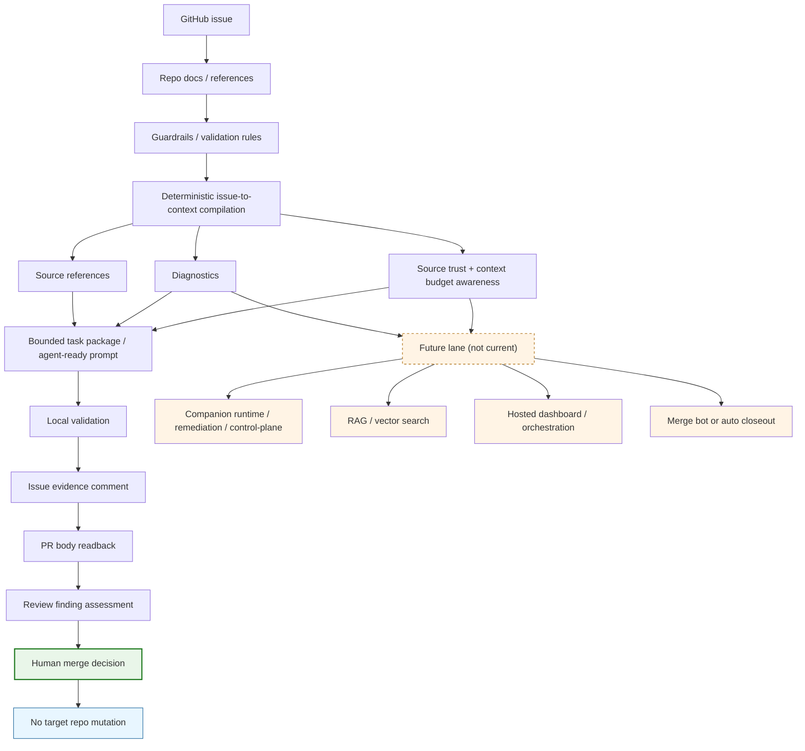

# Issue-to-Context Pipeline Map

## 1. Purpose

This document defines a **minimal issue-to-context pipeline map** for a source-tracked documentation path that can be referenced by future README showcase work.

It is intentionally narrow:

- support future README alignment work,
- avoid claiming implementation for `#120`,
- do not add runtime code,
- do not edit README files in this change.

## 2. Current pipeline summary

Current implemented flow is:

`GitHub issue` → `repo docs / references / guardrails` → `deterministic compile` → `bounded task package / prompt` → `validation / evidence / review closeout` → `human merge decision`

Validation and evidence include readback checks (`PR body` + `issue evidence comment`) before merge, and no automatic merge authority is represented.

## 3. Minimal Mermaid flow



Diagram notes:

- `Human merge decision` is the only authority for merge.
- `No target repo mutation` is explicitly outside the current pipeline.
- The future lane is intentionally kept separate and is **not current**.

## 4. Docs map

| Stage | Current role | Supporting docs | Must not imply |
|---|---|---|---|
| Input | GitHub issue as source entrypoint and intent | README.md, README.en.md, `docs/workflow.md`, `docs/validation.md` | hosted dashboard, project automation, target repo mutation |
| Source discovery | discover references from repo docs/config/guardrails | `docs/workflow.md`, `docs/source-trust.md`, `docs/readme-showcase-readiness.md`, `docs/brand-architecture.md` | fuzzy request ingestion, markdown brief adapter as current, hidden planner |
| Guardrail application | deterministic filtering and evidence policy checks | `docs/source-trust.md`, `docs/validation.md`, `docs/status-runtime-evaluation.md`, `docs/local-status-file-lifecycle.md` | hidden LLM planner, remediation loop, companion runtime |
| Compilation | deterministic issue-to-context packaging | `docs/source-trust.md`, `docs/workflow.md`, `docs/spec-cat-companion-design.md` (design boundary reference only) | autonomous execution, semantic RAG, vector search |
| Prompt handoff | bounded task package + compact handoff prompt | `README.md`, `README.en.md`, `docs/workflow.md`, `docs/product-moat.md` | merge bot, auto reviewer replacement |
| Validation / evidence | local checks + evidence artifacts | `docs/validation.md`, `docs/workflow.md`, `docs/readme-showcase-readiness.md`, `docs/source-trust.md` | automatic proof generation, external truth claims |
| Closeout | review finding assessment + human gate + PR/issue readback | `docs/workflow.md`, `docs/validation.md`, `docs/product-moat.md` | automatic review thread resolution, daemon control |
| Readback governance | PR body and issue evidence verification | `docs/workflow.md`, `docs/validation.md` | PR/body merge automation, status file mutation |
| Future extension points | tracked separately as planned only | `docs/visual-asset-workflow.md`, `docs/status-event-schema.md`, `docs/status-runtime-evaluation.md`, `docs/local-status-file-lifecycle.md` | any current runtime or orchestration claims |

## 5. Current capabilities

- deterministic GitHub issue-to-context compilation
- bounded task package / prompt generation
- source references and diagnostics
- source trust / context budget design direction
- validation / evidence workflow
- readback verification workflow
- read-only label / milestone audit checker
- optional live `gh` smoke test
- human merge decision workflow

## 6. Future / design-only / out-of-scope

The following are explicitly **not** shown as current:

- fuzzy request / markdown brief adapters
- semantic RAG / vector search
- hidden LLM planning
- hosted control plane
- agent orchestration platform
- remediation loop
- merge bot
- automatic review thread resolution
- companion runtime
- daemon / sidecar / watcher
- Tauri app / browser overlay
- Spec Cat UI
- status JSON emitter
- local status file writes
- target repo mutation
- GitHub Projects / roadmap dashboard

## 7. README consumption guidance

When this map is reused in README later:

- README.md / README.en.md captions must stay aligned to avoid language drift.
- Captions should call out which path is current and which is future by label.
- Diagram should not imply runtime, companion, or automation authority.
- Any future capability lane should be visually separated from current flow.
- Keep the source file diffable and text-first.
- If export is ever needed, follow `docs/visual-asset-workflow.md`.

## 8. Review checklist

- [ ] Does the diagram show only current pipeline?
- [ ] Does it preserve human authority over merge?
- [ ] Does it avoid target repo mutation?
- [ ] Does it avoid hosted dashboard, RAG, hidden planner claims?
- [ ] Does it avoid companion runtime / Spec Cat UI as current?
- [ ] Does it keep #149 remediation loop out of current flow?

## 9. Monorepo discovery guidance (Issue #205 docs-only follow-up)

Current discovery is deterministic and bounded; it is designed for initial context collection and not a full monorepo resolver.

- `issue-mentioned references` are treated differently from auto-discovered references.
- `path alias hints` are weak diagnostic signals and are not confirmed issue references.
- `missing`, `unreadable`, and `read failed` diagnostics (including `read failed (EISDIR)`) are expected outputs when configured paths are unreadable or directory inputs are not aligned.
- Source snippets can be truncated when bounded output policy applies, and truncation reasons should remain visible.

### Practical monorepo guidance

For monorepo repos, use explicit package-level discovery paths first:

- `packages/<name>/README.md`
- `packages/<name>/docs/architecture.md`
- `apps/<name>/README.md`
- `apps/<name>/docs/usage.md`

Example config shape (sanitized):

```json
{
  "discovery": {
    "docs": [
      "packages/<name>/README.md",
      "packages/<name>/docs/architecture.md"
    ],
    "source": [
      "packages/<name>/src",
      "packages/<name>/browser"
    ]
  }
}
```

Virtual/export path handling guidance:

- If an issue mentions `vitest/browser/context.d.ts`, actual source may live under `packages/vitest/browser/context.d.ts`.
- Current CLI `discovery.source` 行為只走目錄式來源，不保證可設定單一 file path；請視為 issue-mentioned 參考線索而非已實作的 explicit file config 支援。
- 如需這類 file-level support，建議另開 follow-up issue；本次不在 #205 內實作。

Troubleshooting `EISDIR`:

- If you see `read failed (EISDIR)` for a configured path, verify whether the config entry shape matches current field expectations.
- For `discovery.docs`, prefer explicit Markdown files; directory paths may trigger `read failed (EISDIR)` with current explicit-file loading.
- For `discovery.source`, prefer directory roots that exist in the repo and are intended for recursive scanning.

### Evidence tie-in

- The Vitest dogfood report `docs/dogfood/vitest-2026-05-09.md` (WARN verdict) shows monorepo path inference and directory input friction.
- This supports documentation-first follow-up, and it does not itself justify a runtime monorepo walker in this issue.
- It also does not imply runtime zh-TW classifier changes.
